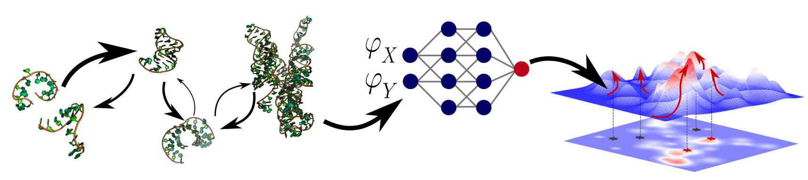

---
# Feel free to add content and custom Front Matter to this file.
# To modify the layout, see https://jekyllrb.com/docs/themes/#overriding-theme-defaults

layout: home
---

<!-- 

 -->

  

    

    <h1>Vaitea OPUU</h1>
    
    

    I'm a CNRS researcher (CR) in computational biology working at <a href="https://www.lbe.espci.fr/home/">ESPCI</a>.
    I develop computational methods to engineer proteins and RNAs that are at the interface between machine learning and physics.
    

    <strong></strong>
    <strong></strong>
  

    <h2 class="feed-title">News</h2>
    

      
      

        {{ post.title }}
        
{{ post.content }} {{ post.date }}

      

      
    

  

 

# Research topics

  
    

      

        <a class="research-link" href="{{ project.url | relative_url }}">
        
         
          {{ project.name | escape }}
        </a>
        
{{ project.description }}

      

    

  

